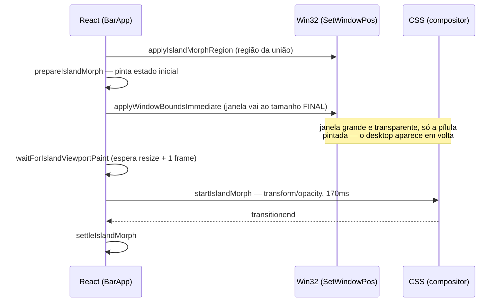
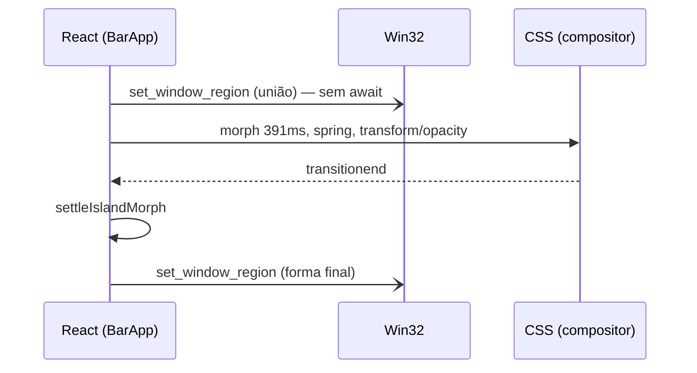

# SDD — Ilha flutuante: envelope fixo e morph contínuo

Documento de design para o refactor do morph da ilha (`apps/desktop`). Descreve por que a transição atual não é fluida, qual mudança estrutural resolve, e o que exatamente muda em cada módulo.

- **Status:** proposto
- **Escopo:** janela `main`, modos `compact` ↔ `quick-menu` ↔ `checklist`
- **Fora de escopo:** modo `edge-collapsed`, janela `panel`
- **Branch de origem:** `fix/floating-island-morph-flicker`

---

## 1. Contexto

A ilha flutuante é a superfície principal do Linvo no desktop: uma pílula sempre visível que se transforma em painel de chat (`quick-menu`) ou em checklist de procedimento. A identidade do produto depende dessa forma única que se transforma — não de uma barra que some e um painel que aparece.

Geometria atual (`lib/window-mode.ts`):

| Modo | Desenho (lógico) | Janela | Raio |
|------|------------------|--------|------|
| `compact` | 168 × 34 | 380 × 34 | 17px (metade da altura) |
| `quick-menu` | 380 × 520 | 380 × 520 | 14px |
| `checklist` | 288 × 420 | 380 × 420 | 14px |
| `edge-collapsed` | 12 × 112 | 12 × 112 | 0 |

A janela tem largura fixa de 380px em todos os modos (`ISLAND_WINDOW_WIDTH`). As faixas transparentes que sobram são removidas da HWND por `SetWindowRgn` (`lib/window-region.ts` → `src-tauri/src/lib.rs::set_window_region`), para não captarem cliques do desktop.

### Como o morph funciona hoje

O morph é feito em **duas metades independentes**, uma nativa e uma CSS:



No colapso a ordem inverte: o CSS encolhe primeiro, o `SetWindowPos` vem depois.

---

## 2. Problema

A transição não lê como morph contínuo. Lê como um snap com borrão.

### Causa 1 — o resize nativo está no caminho crítico

A forma animada não pode ultrapassar as bordas da janela. Então a janela precisa crescer **antes** do CSS começar e encolher **depois** dele terminar. Todo frame no intervalo é uma janela transparente com o desktop visível onde o painel ainda não está.

A consequência não é o flicker em si — é o **orçamento de tempo**. `ISLAND_MORPH_DURATION_MS = 170` (`lib/floating-island-transition.ts:3`) existe para encurtar a janela de exposição, não porque 170ms seja a duração certa. Uma Dynamic Island roda ~400ms com spring. Enquanto o `SetWindowPos` estiver no caminho crítico, não há como chegar lá.

O custo dessa amarração está escrito no próprio código, em três lugares distintos:

- `BarApp.tsx:195-233` — `waitForIslandViewportPaint`, barreira entre o commit nativo e o primeiro frame de CSS, com watchdog de 180ms
- `lib/floating-quick-menu-mode.ts:232-240` — mínimo e `setResizable` movidos para o *prepare* porque ~150ms de IPC no commit deixavam ~240ms de buraco visível
- `lib/floating-island-transition.ts:185-221` — `axisPlacement` escreve todo offset como `calc((100% - Xpx) * ratio + Δpx)`, para a geometria continuar correta nos **dois** viewports, já que o WebView é redimensionado no meio da transição

### Causa 2 — a escala distorce raio e hairline

`resolveRectFlip` (`lib/floating-island-transition.ts:261`) escala a superfície inteira. Abrindo o `quick-menu`, a altura interna vai de 32 → 518: **scaleY ≈ 16,2**.

| Camada | No início do morph | No fim |
|--------|--------------------|--------|
| Pílula (sai) | raio 17px correto, anel de 1px | anel esticado a **~16px** na vertical enquanto some |
| Painel (entra) | raio 14px comprimido a **~0,9px** na vertical (canto quase reto), hairline sub-pixel | correto |

Durante os 90ms de cross-fade (`--motion-duration-island-fade`) o usuário vê um retângulo de cantos errados crescendo por baixo da pílula. É isso que lê como borrão.

### Causa 3 — a curva não é um spring

`cubic-bezier(0.2, 0.82, 0.2, 1)` em 170ms é um ease-out rápido. Não tem antecipação nem overshoot. Movimento sem massa não lê como "vivo".

---

## 3. Objetivos

1. Tirar toda chamada nativa de janela do caminho crítico do morph
2. Permitir uma duração de ~400ms com spring sem expor o desktop em nenhum frame
3. Manter os cantos geometricamente corretos durante a transição inteira
4. Não regredir: posição persistida, snap às bordas, DPI fracionário, multi-monitor

### Não-objetivos

- Animar a HWND frame a frame (já tentado duas vezes, trepida — ver `lib/floating-quick-menu-mode.ts:52-61`)
- Trocar o modo `edge-collapsed`, que já usa resize nativo animado e não tem requisito de continuidade
- Adotar biblioteca de animação (ver §11)

---

## 4. Decisão de design: envelope fixo

**A janela flutuante passa a ter tamanho fixo, dimensionado para o maior modo mais folga de sombra, e nunca é redimensionada durante uma interação.** Todo o morph acontece por CSS dentro dela.

É a "Opção A" clássica — janela grande transparente, anima só o conteúdo. O que a torna viável no Windows, e o que normalmente falta nessa recomendação, é que **o recorte de região já existe neste projeto**. `SetWindowRgn` remove as áreas transparentes da HWND, então uma janela grande não vira um comedor de cliques.

### Geometria

```
ISLAND_ENVELOPE_PAD  = 24
ISLAND_ENVELOPE_SIZE = { width: 428, height: 568 }   // 380+48 × 520+48
```

Retângulos do desenho, em coordenadas do envelope, com crescimento para baixo:

| Modo | x | y | w | h |
|------|---|---|---|---|
| `compact` | 130 | 24 | 168 | 34 |
| `quick-menu` | 24 | 24 | 380 | 520 |
| `checklist` | 70 | 24 | 288 | 420 |

A pílula fica no **topo** do envelope; os painéis crescem para baixo a partir da mesma borda superior. Os 24px de folga existem para a sombra externa — hoje impossível, porque a janela tem exatamente o tamanho do elemento (`index.css:505-510`).

### Direção de crescimento

Perto da borda inferior da tela o painel precisa crescer para cima. A direção é resolvida **em repouso**, nunca durante um morph:

```
pillScreen = envelopePosition + pillOffset(growth)

growth = "down"  →  pillOffset = { x: 130, y: 24 }
growth = "up"    →  pillOffset = { x: 130, y: 568 - 24 - 34 } = { x: 130, y: 510 }
```

Ao trocar a direção, o envelope é movido pelo delta exato do offset, de modo que **`pillScreen` não muda**. O usuário não vê nada acontecer.

### Recorte de região

| Momento | Região | Está no caminho crítico? |
|---------|--------|--------------------------|
| Repouso | retângulo exato do modo, raio do modo | não |
| Início do morph | união dos dois retângulos, raio 14 | não — disparada antes, sem bloquear |
| Fim do morph | retângulo exato do modo destino | não — depois da animação |

Duas chamadas de IPC por morph, nenhuma delas entre dois frames animados. Hoje são duas chamadas **mais** um `SetWindowPos` bloqueante no meio.

### O que isso apaga

Como o viewport deixa de mudar durante a transição, uma classe inteira de complexidade some:

- `axisPlacement` volta a ser px puro — o `calc((100% - Xpx) * ratio + Δpx)` existe só para sobreviver a dois viewports
- `waitForIslandViewportPaint` deixa de existir
- `ensureCompactWindowBounds` reduz-se a reconciliar região, não bounds
- `withCenteredVisualRects` deixa de existir: os retângulos já são os do desenho

---

## 5. Arquitetura proposta



Nenhuma seta bloqueante entre o início e o fim da animação.

```
┌──────────────────────────────────────────────┐
│  HWND fixa 428×568, transparente, topmost    │
│  recortada por SetWindowRgn na forma atual   │
│                                              │
│   ┌────────────────────────────────────┐     │
│   │  .floating-island-stage            │     │
│   │                                    │     │
│   │   superfície (raio + sombra)       │     │
│   │   conteúdo (cross-fade)            │     │
│   └────────────────────────────────────┘     │
│                                              │
└──────────────────────────────────────────────┘
```

---

## 6. Mudanças por módulo

| Arquivo | Mudança |
|---------|---------|
| `lib/window-mode.ts` | Adiciona `ISLAND_ENVELOPE_SIZE`, `ISLAND_ENVELOPE_PAD`, `islandRectForMode(mode, growth)`. `ISLAND_WINDOW_WIDTH` deixa de ser o tamanho da janela e vira só a largura do painel |
| `lib/window-region.ts` | `applyIslandWindowRegion` passa a receber um **retângulo em coordenadas do envelope**, em vez de derivar `left` de `(ISLAND_WINDOW_WIDTH - visual.width) / 2` |
| `lib/floating-island-transition.ts` | Remove `withCenteredVisualRects` e o `calc()` de `axisPlacement`; `IslandMorphGeometry` perde o campo `viewport` |
| `lib/floating-quick-menu-mode.ts` | Remove `applyWindowBoundsImmediate` do caminho de expandir/colapsar. Sobra: região + hooks |
| `lib/floating-checklist-mode.ts` | Idem |
| `lib/floating-compact-bounds.ts` | Reconciliação passa a corrigir região e posição do envelope, não tamanho |
| `lib/window-transition.ts` | `resolveExpandPlan` / `resolveCollapsePosition` deixam de participar do morph; seguem servindo `edge-collapsed` e o restore de boot |
| `lib/window-restore-origin.ts` | **Pode ser removido.** Existe para a pílula voltar ao pixel exato depois de um resize; sem resize, não há de onde escorregar |
| `lib/window-storage.ts` | Posição persistida passa a ser a da **pílula na tela**, não a da janela. Nova chave versionada + migração |
| `hooks/use-window-position.ts` | `resolveSnap` passa a receber o retângulo da pílula; `onMoved` converte posição do envelope → posição da pílula antes de persistir |
| `components/floating-island-shell.tsx` | Superfície única animando `width`/`height`/`border-radius`; remove o cross-fade de duas superfícies |
| `BarApp.tsx` | Remove `waitForIslandViewportPaint`; `prepareIslandMorph` deixa de precisar da barreira de dois viewports |
| `index.css` | Curva `linear()` de spring; sombra externa nas superfícies da ilha |

### Migração da posição persistida

Hoje `POSITION_STORAGE_KEY` guarda a posição da janela de 380px de largura, com a pílula centralizada dentro dela. A pílula está 106px à direita: `(380 - 168) / 2`.

```
pillX = oldWindowX + 106
pillY = oldWindowY
```

Migração de leitura única, sob chave nova (`linvo:island-pill-position`), com a chave antiga preservada para permitir rollback de versão sem perder a posição do usuário.

### Snap às bordas

Este é o ponto que mais silenciosamente quebra. `resolveSnap` (`lib/window-anchor.ts`) recebe hoje `position` e `size` da janela. Com o envelope, passar os valores da janela grudaria a **borda do envelope** na borda da tela, deixando a pílula a 130px de distância (24 de folga + 106 de centralização). O snap tem que operar sobre o retângulo da pílula, e a posição resultante ser convertida de volta para posição de envelope na hora de aplicar.

---

## 7. Curva de movimento

Spring subamortecido amostrado para `linear()`, suportado no WebView2 (Chromium evergreen no Windows 11). Continua no compositor, sem custo de main thread.

Perfil escolhido — `response = 0.38s`, `damping = 0.82` → **391ms, overshoot 1,1%**:

```css
--motion-duration-island: 391ms;
--motion-ease-island: linear(
  0, 0.0653, 0.209, 0.3761, 0.5357, 0.6727, 0.7818, 0.8637,
  0.922, 0.9613, 0.986, 1.0005, 1.0079, 1.0107, 1.011, 1.0098, 1
);
```

Alternativas amostradas, caso o overshoot precise de ajuste fino na mão:

| response | damping | duração | overshoot |
|----------|---------|---------|-----------|
| 0.34 | 0.90 | 319ms | 0,0% |
| **0.38** | **0.82** | **391ms** | **1,1%** |
| 0.42 | 0.78 | 454ms | 2,0% |

O overshoot precisa ser pequeno: a superfície é grande, e um bounce visível numa janela de 520px lê como instabilidade, não como massa. 1% é o suficiente para o olho registrar inércia.

O conteúdo (`--motion-duration-island-content`, hoje 100ms com 35ms de atraso) segue mais curto que a forma e mantém ease-out simples — texto que faz overshoot fica ilegível.

---

## 8. Correção do raio e do hairline

Com o resize fora do caminho crítico, o cross-fade de duas superfícies deixa de ser necessário. A ilha passa a ser **uma superfície só**, animando `width`, `height` e `border-radius` diretamente.

Custo: essas três propriedades não são de compositor — cada frame re-rasteriza a camada. Foi exatamente isso que foi medido piscando antes (`index.css:566-574`), **mas foi medido com o `SetWindowPos` disputando os mesmos frames**. Sem essa disputa, uma camada de 428×568 num WebView2 moderno deve caber no orçamento de frame com folga.

Ganho: cantos corretos em todos os frames, hairline de 1px real do começo ao fim, e o desaparecimento do cross-fade — que é o que hoje faz a transição parecer dupla em vez de contínua.

**Este é o único item do plano com risco de performance real.** Ver fase 3 e o critério de saída em §10.

---

## 9. Plano de execução

Cada fase é um commit próprio, com a suíte verde.

| Fase | Conteúdo | Reversível? |
|------|----------|-------------|
| **0** | Constantes do envelope + `islandRectForMode` + testes. Nenhuma mudança de comportamento | trivial |
| **1** | Janela nasce com o envelope; região recebe retângulo explícito; morph para de redimensionar. Migração de posição, snap sobre a pílula | sim, é a fase grande |
| **2** | Remove a máquina de dois viewports: `axisPlacement` em px, `waitForIslandViewportPaint`, `withCenteredVisualRects`, `window-restore-origin` | sim |
| **3** | Spring `linear()`, superfície única com raio animado, sombra externa | sim, independente |

A fase 1 concentra o risco. As fases 2 e 3 são cada uma reversível sozinha — se a superfície única piscar, a fase 3 volta atrás sem desfazer o envelope, e o cross-fade de duas superfícies continua funcionando, agora com 391ms de orçamento em vez de 170ms.

---

## 10. Critérios de aceite

1. Nenhuma chamada de `set_window_bounds` entre o primeiro e o último frame do morph, nos modos `compact` ↔ `quick-menu` ↔ `checklist` — verificável por teste com o IPC dublado
2. Abrir e fechar o chat 20 vezes seguidas não desloca a pílula em nenhum pixel, em escala 100%, 125%, 150% e 175%
3. Arrastar a pílula até 40px de qualquer borda gruda **a pílula** na borda, não o envelope
4. Clique no desktop atrás de qualquer área transparente do envelope chega ao desktop, em repouso e durante o morph
5. Posição salva na versão anterior é restaurada no mesmo lugar após atualizar
6. Fase 3: morph sem frame perdido em captura a 60fps, num monitor 1080p em escala 125%. Se falhar, a fase 3 volta e o cross-fade permanece

---

## 11. Alternativas consideradas

**Framer Motion / `motion` com `layoutId` + `AnimatePresence`.** Rejeitada como solução do problema principal. Shared layout animation é FLIP por `transform` — exatamente a técnica já implementada à mão em `resolveSurfaceLayers`. A biblioteca não sabe nada sobre a HWND e não tira o `SetWindowPos` do caminho crítico. O que ela resolveria é a distorção de raio (§2, causa 2), que o Framer corrige automaticamente durante layout animations — mas §8 resolve o mesmo pela raiz, sem +50kb e sem trocar código compreendido por uma dependência.

**Animar a HWND frame a frame.** Já tentada duas vezes neste projeto (expansão em duas fases, depois fase única mais curta) e trepidou nas duas. O WebView2 refaz o layout do DOM a cada `SetWindowPos`, e no Tauri isso é mais caro que no Wry (`tauri-apps/tauri#6322`).

**Região recalculada por frame.** Manteria a janela ajustada à forma durante a animação inteira, mas custa uma chamada de IPC por frame — 60/s através da ponte do Tauri. Descartada sem medir; a união durante o morph resolve o mesmo problema com duas chamadas.

**Envelope de tela cheia.** Elimina qualquer reposicionamento, incluindo a troca de direção de crescimento. Descartada: uma janela topmost do tamanho da tela interage mal com o gerenciador de janelas do Windows (Aero Snap, `Win+D`, ordenação de topmost) e torna o recorte de região a única barreira contra capturar o desktop inteiro. A folga de 24px entrega o mesmo ganho com uma superfície de risco muito menor.
