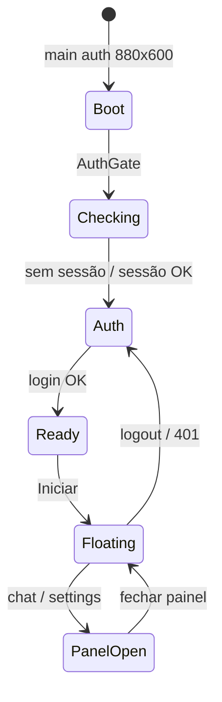

# Usabilidade com Tauri — Linvo Desktop

Guia de melhorias de UX no app desktop (`apps/desktop`), usando APIs e plugins nativos do **Tauri v2**. Cada item descreve o problema atual, o impacto para o usuário e **como implementar** no nosso código.

---

## Contexto do produto

O Linvo Desktop é um assistente de atendimento que vive na borda da tela:

| Superfície | Janela | Tamanho | Comportamento |
|------------|--------|---------|---------------|
| **Auth** | `main` | 880×600 | Login, registro, tela "Pronto" |
| **Compact** | `main` | 140×40 | Barra flutuante always-on-top, independente |
| **Painel** | `panel` | 900×600 | Chat e configurações com rotas (`#/chat`, `#/settings/*`) |

Existem **duas janelas Tauri** (`main` e `panel`). A barra flutuante permanece visível enquanto o painel abre em janela separada. O Rust expõe `panel_open`/`panel_close`, animação de bounds e keychain; o React orquestra auth na `main` e rotas no painel via `HashRouter`.



---

## O que já funciona com Tauri

| Recurso | Onde está |
|---------|-----------|
| Janela frameless e transparente | `tauri.conf.json`, `window-auth.ts` |
| Animação nativa resize/move | `src-tauri/src/lib.rs` → `animate_window_bounds` |
| Fallback JS se animação falhar | `lib/window-animation.ts` → `applyWindowBoundsWithFallback` |
| Drag region (mover janela) | `data-tauri-drag-region` na barra, auth e painéis |
| System tray contextual (barra, chat, config, ocultar, sair) | `lib/system-tray.ts`, `lib/app-windows.ts`, `lib/tray-handlers.ts` |
| Fechar → bandeja (modo flutuante) | `onCloseRequested` em `use-system-tray.ts` |
| Persistência de posição | `lib/window-storage.ts` + `onMoved` |
| Keychain para JWT | `src-tauri/src/auth.rs` + `lib/auth/token-store.ts` |
| Gate auth ↔ flutuante | `auth-gate.tsx`, `enter-floating-mode.ts` |
| Painel multi-janela + rotas | `panel.rs`, `lib/panel-window.ts`, `PanelApp.tsx`, `components/panel/*` |
| Sync de sessão entre janelas | `lib/auth-sync.ts`, `hooks/use-panel-session.ts` |
| Plugin opener (registrado) | `Cargo.toml`, `capabilities/default.json` |

---

## Mapa de melhorias

### Prioridade alta — impacto imediato na experiência

---

### 1. Corrigir janela inicial no boot (flash da barra flutuante)

**Problema:** `tauri.conf.json` nasce em modo compact (140×40, `alwaysOnTop: true`, `skipTaskbar: true`), mas o usuário ainda não autenticou. Na fase `checking`, a tela mostra "Validando sessão..." dentro de uma barra minúscula.

**Impacto:** Primeira impressão confusa; parece bug.

**Como implementar:**

1. Ajustar `tauri.conf.json` para o modo auth como padrão:

```json
{
  "width": 880,
  "height": 600,
  "resizable": true,
  "alwaysOnTop": false,
  "skipTaskbar": false,
  "center": true
}
```

2. Aplicar superfície auth **antes do primeiro paint** na fase `checking`:

```typescript
// hooks/use-auth.ts — novo efeito no mount
useEffect(() => {
  void applyWindowSurface("auth");
}, []);
```

3. Manter `enterFloatingMode()` como transição animada auth → compact ao clicar em **Iniciar**.

**Arquivos:** `tauri.conf.json`, `hooks/use-auth.ts`, `lib/auth/apply-window-surface.ts`

---

### 2. System tray em todo o ciclo de vida

**Status:** implementado com menu contextual multi-janela.

| Fase | Itens do menu |
|------|---------------|
| Auth | Abrir Linvo Desktop, Ocultar, Sair |
| Floating | Mostrar barra, Abrir chat, Abrir configurações, Ocultar tudo, Sair |

- Clique esquerdo no ícone: toggle mostrar/ocultar tudo
- `Ctrl+Shift+L`: mesmo toggle
- **Sair**: logout + fecha painel + `app_quit`
- **Ocultar**: esconde `main` + `panel`

**Arquivos:** `lib/system-tray.ts`, `lib/app-windows.ts`, `lib/tray-handlers.ts`, `auth-gate.tsx`, `src-tauri/src/app.rs`

---

### 3. Atalho global para mostrar/ocultar

**Status:** implementado com `Ctrl+Shift+L` via `toggleAppVisibility()` em `hooks/use-global-shortcut.ts`.

- Toggle mostra a barra ou oculta `main` + `panel`
- Mesmo comportamento do clique esquerdo no ícone da bandeja

**Arquivos:** `hooks/use-global-shortcut.ts`, `lib/app-windows.ts`

---

### 4. Permissão explícita para `animate_window_bounds`

**Problema:** O comando customizado não tem ACL em `permissions/`. Se o runtime bloquear, a animação falha silenciosamente e cai no fallback instantâneo.

**Impacto:** Transições sem animação; sensação de app "travado".

**Como implementar:**

1. Criar `src-tauri/permissions/animation.toml`:

```toml
[[permission]]
identifier = "allow-animate-window-bounds"
description = "Allows animating window position and size"
commands.allow = ["animate_window_bounds"]
```

2. Referenciar em `capabilities/default.json`:

```json
"permissions": [
  "allow-animate-window-bounds",
  ...
]
```

3. Regenerar schemas com `pnpm tauri build` ou `tauri dev`.

**Arquivos:** `permissions/animation.toml`, `capabilities/default.json`

---

### Prioridade média — produtividade e confiança

---

### 5. Autostart com o sistema operacional

**Problema:** Usuário precisa abrir o app manualmente a cada boot.

**Impacto:** Assistente de atendimento deixa de estar "sempre disponível".

**Como implementar:**

```bash
pnpm --filter @linvo/desktop tauri add autostart
```

```typescript
import { enable, disable, isEnabled } from "@tauri-apps/plugin-autostart";

// settings-view.tsx — toggle
await enable();
await disable();
const on = await isEnabled();
```

**Arquivos:** `Cargo.toml`, `lib.rs`, `capabilities/default.json`, `components/settings/settings-view.tsx`

**Referência:** [tauri-plugin-autostart](https://v2.tauri.app/plugin/autostart/)

---

### 6. Notificações nativas para erros de sessão e rede

**Problema:** `BOOT_NETWORK_ERROR` e `401` só aparecem na UI inline. Se a janela está oculta na bandeja, o usuário não vê.

**Impacto:** Sessão expira sem aviso perceptível.

**Como implementar:**

```bash
pnpm --filter @linvo/desktop tauri add notification
```

```typescript
import {
  isPermissionGranted,
  requestPermission,
  sendNotification,
} from "@tauri-apps/plugin-notification";

// hooks/use-auth.ts — após BOOT_NETWORK_ERROR ou UNAUTHORIZED
if (await isPermissionGranted()) {
  sendNotification({ title: "Linvo Desktop", body: "Sessão expirada. Faça login novamente." });
}
```

**Arquivos:** `hooks/use-auth.ts`, `lib.rs`, `capabilities/default.json`

---

### 7. Unificar minimizar / fechar / sair

**Status:** implementado para auth, barra flutuante, painel e menu da bandeja.

| Ação | Comportamento |
|------|---------------|
| **Minimizar** (─) | `hideAllWindows()` em qualquer modo |
| **Fechar** (×) em auth/barra | `hideAllWindows()` via `onCloseRequested` |
| **Fechar** (×) no painel | `closePanel()` (barra permanece) |
| **Sair** (menu tray) | `logout()` + `app_quit` |

**Arquivos:** `lib/app-windows.ts`, `context/window-chrome-context.tsx`, `auth-layout.tsx`, `floating-bar.tsx`, `panel-titlebar.tsx`, `lib/system-tray.ts`

---

### 8. Botão Gravar com função real (ou remover)

**Problema:** `FloatingBar` tem botão de gravar (`onRecord`) mas `App.tsx` não passa handler — affordance morta.

**Impacto:** Usuário clica e nada acontece; perda de confiança.

**Como implementar (opção A — gravar tela):**

1. Comando Rust para captura ou integração com API do SO.
2. Plugin `tauri-plugin-store` para salvar preferência de gravação.
3. Conectar em `App.tsx`:

```typescript
<FloatingBar onRecord={() => void startRecording()} ... />
```

**Como implementar (opção B — remover até existir feature):**

Remover botão ou desabilitar com tooltip "Em breve".

**Arquivos:** `App.tsx`, `floating-bar.tsx`, eventual novo módulo Rust

---

### 9. Indicador de status real na barra

**Problema:** `isActive` está hardcoded como `true` em `App.tsx`.

**Impacto:** Bolinha verde sempre acesa mesmo sem conexão com API ou sessão válida.

**Como implementar:**

```typescript
// App.tsx
const isActive =
  authPhase === "floating" &&
  !sessionWarning &&
  apiReachable;
```

Opcionalmente, comando Rust para checar conectividade de rede do SO e combinar com health check da API.

**Arquivos:** `App.tsx`, `hooks/use-auth.ts`, possível `lib/health.ts`

---

### 10. Persistência de posição mais robusta

**Problema:** Posição salva em `localStorage` do webview. Limpeza de cache ou reinstall perde a posição.

**Impacto:** Janela volta ao canto padrão sem o usuário querer.

**Como implementar:**

```bash
pnpm --filter @linvo/desktop tauri add store
```

```typescript
import { Store } from "@tauri-apps/plugin-store";

const store = await Store.load("window.json");
await store.set("position", { x, y });
await store.save();
```

Migrar `lib/window-storage.ts` para usar o plugin mantendo a mesma interface pública.

**Arquivos:** `lib/window-storage.ts`, `Cargo.toml`, `capabilities/default.json`

**Referência:** [tauri-plugin-store](https://v2.tauri.app/plugin/store/)

---

### Prioridade baixa — polish e futuro

---

### 11. Efeitos visuais na janela (blur / vibrancy)

**Problema:** `transparent: true` sem efeito nativo pode gerar legibilidade ruim sobre wallpapers claros.

**Como implementar:**

```typescript
import { getCurrentWindow } from "@tauri-apps/api/window";

await getCurrentWindow().setEffects({
  effects: ["blur"],
  state: "active",
  radius: 16,
});
```

Requer permissão `core:window:allow-set-effects` e suporte por plataforma (macOS melhor; Windows limitado).

**Arquivos:** `apply-window-surface.ts`, `capabilities/default.json`

---

### 12. Abrir links externos com segurança

**Problema:** Plugin `opener` está instalado mas não usado no frontend.

**Como implementar:**

```typescript
import { openUrl } from "@tauri-apps/plugin-opener";

await openUrl("https://docs.linvo.app/ajuda");
```

Usar em links de suporte, termos e documentação nas telas de auth e settings.

**Arquivos:** `components/auth/*`, `components/settings/settings-view.tsx`

---

### 13. Deep link para OAuth / magic link (futuro)

**Problema:** Login social ou link mágico por e-mail precisa reabrir o app com token.

**Como implementar:**

```bash
pnpm --filter @linvo/desktop tauri add deep-link
```

Registrar scheme `linvo://` em `tauri.conf.json` e escutar no Rust para repassar ao frontend.

**Arquivos:** `tauri.conf.json`, `lib.rs`, `hooks/use-auth.ts`

---

### 14. Refinar animação Rust

**Problema:** `run_animation` usa `thread::sleep` em loop bloqueante. `enter-floating-mode.ts` chama `setSize`/`setPosition` após animação (redundante na maioria dos casos).

**Impacto:** Micro-stutter em máquinas lentas; código duplicado.

**Como implementar:**

- Avaliar timer baseado em `Instant` sem sleep fixo, ou delegar interpolação ao frontend com `requestAnimationFrame` + comandos leves.
- Remover `setSize`/`setPosition` duplicados quando flags de janela não alteram bounds.

**Arquivos:** `src-tauri/src/lib.rs`, `lib/auth/enter-floating-mode.ts`

---

### 15. CSP e hardening

**Problema:** `csp: null` em `tauri.conf.json`.

**Como implementar:** Definir CSP restritiva permitindo apenas `devUrl` em dev e assets locais em produção.

**Arquivos:** `tauri.conf.json`

---

### 16. Multi-monitor: lembrar monitor, não só posição

**Problema:** `clampToMonitor` corrige posição, mas não restaura em qual monitor o usuário deixou a barra.

**Como implementar:**

```typescript
const monitor = await currentMonitor();
await store.set("monitor", { name: monitor.name, position: monitor.position });
```

Na restauração, buscar monitor pelo nome/posição antes de `clampToMonitor`.

**Arquivos:** `lib/window-storage.ts`, `hooks/use-window-position.ts`, `lib/auth/enter-floating-mode.ts`

---

### 17. Feedback háptico / sonoro leve (opcional)

**Problema:** Ações como "Iniciar" ou abrir chat não têm confirmação sensorial.

**Como implementar:** Som curto via Web Audio API no frontend (sem plugin) ou notificação silenciosa no tray. Evitar plugins extras se não agregar valor.

---

## Roadmap sugerido

| Sprint | Itens | Resultado esperado |
|--------|-------|-------------------|
| **S1** | #1, #2, #4, #7 | Boot correto, tray global, animação confiável, fechar previsível |
| **S2** | #3, #6, #9 | Atalho global, notificações, status real |
| **S3** | #5, #10, #12 | Autostart, persistência robusta, links externos |
| **S4** | #8, #11, #16 | Gravar ou remover, efeitos visuais, multi-monitor |
| **Backlog** | #13, #14, #15, #17 | OAuth deep link, polish Rust, segurança |

---

## Checklist por feature nova

Ao adicionar qualquer capacidade Tauri:

1. **Plugin Rust** — `tauri add <plugin>` ou comando em `lib.rs`
2. **Permissão** — `permissions/*.toml` + `capabilities/default.json`
3. **Bridge TS** — hook ou lib em `src/lib/` / `src/hooks/`
4. **Teste** — mock em `src/test/mocks/tauri.ts` + Vitest
5. **Fallback** — comportamento degradado se permissão negada ou SO sem suporte
6. **UX copy** — tooltip e mensagem em português

---

## Referências

- [Tauri v2 — Window API](https://v2.tauri.app/reference/javascript/api/namespacewindow/)
- [Tauri v2 — Plugins](https://v2.tauri.app/plugin/)
- [Capabilities & Permissions](https://v2.tauri.app/security/capabilities/)
- Código atual: `apps/desktop/src-tauri/`, `apps/desktop/src/hooks/`, `apps/desktop/src/lib/`

---

## Como contribuir

1. Escolha um item pelo número deste documento.
2. Abra issue ou task referenciando `USABILIDADE-TAURI.md#N`.
3. Implemente seguindo o checklist acima.
4. Valide manualmente com `pnpm --filter @linvo/desktop tauri dev` (reinicie o processo após mudanças em hooks de janela nativa — HMR não recarrega bem comandos Rust).
