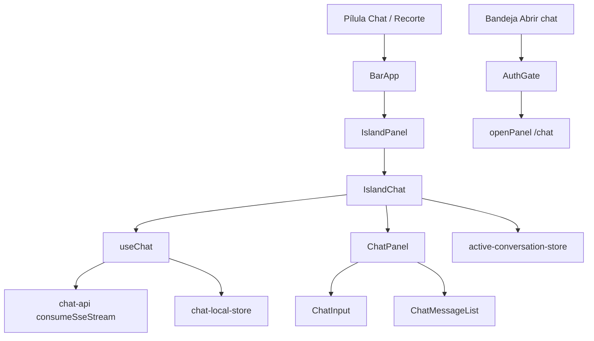

# Research: Assist / chat na ilha hoje

Status: Draft
Date: 2026-09-11
Feature: `apps/desktop/specs/assist-island-chat`
Branch observada: `fix/floating-island-morph-flicker` (IslandChat **não** está no `main`)

## Problem Summary

O épico KAN-3 pede que o Quick Center vire chat live na ilha. Nesta branch o runtime **já saiu** do prompt descartável (`QuickCenterPanel` + `useQuickPrompt`) e monta `IslandChat` → `useChat` → `ChatPanel`. O Jira ainda está “A fazer”. O que falta não é o stream: é perfil Assist (Nova pergunta, parar, copiar, tray, rename, citações, resumo do print) e a suíte de testes, que ainda descreve o produto antigo.

## Relevant Files

| File | Role | Key entry |
|------|------|-----------|
| `src/BarApp.tsx` | Orquestra modos; monta `IslandPanel` no `quick-menu` | ~1038 |
| `src/components/quick-center/island-panel.tsx` | Chrome da ilha; `openPanel` só no maximize | 37, 66, 87 |
| `src/components/quick-center/island-chat.tsx` | `useChat` + `ChatPanel` | 71, 111 |
| `src/components/quick-center/quick-center-panel.tsx` | Legado; **não montado** | 72, 371 |
| `src/hooks/use-chat.ts` | SSE, anexos, tools; **sem `stop` exportado** | 1093 |
| `src/hooks/use-quick-prompt.ts` | Stream simples + `stop()`; onboarding ainda usa | 39, 49 |
| `src/components/chat/chat-panel.tsx` | Layout compartilhado; sem `onStop` / `onCopy` | 11–41 |
| `src/components/chat/chat-input.tsx` | Capture chip; Enviar; sem Parar | 446, 506 |
| `src/lib/chat/active-conversation-store.ts` | `linvo:island-active-conversation` | 1, 16 |
| `src/lib/window-mode.ts` | `QUICK_MENU_SIZE` 380×520 | 16 |
| `src/components/auth/auth-gate.tsx` | Tray `openChat` → `openPanel("/chat")` | 24–28 |
| `src/lib/system-tray.ts` | Menu “Abrir chat” / sem “Abrir workspace” | 58–73 |
| `packages/shared/src/chat.ts` | `messageSchema` sem `citations` | 195 |
| `src/BarApp.test.tsx` | Ainda busca `"Quick Center"` | 181 |

## Information Flow

No `main` (não nesta branch): pílula → `QuickCenterPanel` → `useQuickPrompt` → uma string de resposta.

## Findings

### F-1 — A ilha já usa `useChat`

`island-chat.tsx` monta o mesmo hook do painel. Não há segundo cliente SSE na ilha.

### F-2 — `QuickCenterPanel` não está no runtime

`BarApp` importa `IslandPanel`. `QuickCenterPanel` permanece no disco e nos testes. `useQuickPrompt` ainda alimenta o onboarding (`first-question-step.tsx`).

### F-3 — Send da ilha não abre o painel

`IslandChat` / `useChat` não chamam `openPanel`. O único `openPanel` na ilha é o botão “Abrir na janela grande” (`island-panel.tsx:66`), que lê o id em `active-conversation-store` e navega `/chat/:id`.

### F-4 — Parar sumiu na migração

`useQuickPrompt.stop()` e o botão “Parar” existiam no legado. `useChat` aborta internamente ao trocar de conversa (`abortRef`) mas **não exporta** `stop`. `ChatInput` só mostra Enviar. O comentário em `island-panel.tsx` que afirma que `ChatInput` já traz o botão de parar está **errado**.

### F-5 — Anexos e capture chip já estão na ilha

`IslandChat` passa `captureWindowLabel="main"` e `autoStartCapture`. `ChatInput` tem picker + recorte magnético. Upload coberto em `use-chat.test.tsx`.

### F-6 — Sem sidebar de threads na ilha

A lista de conversas vive no `panel-sidebar`. A ilha não lista 40 threads. Isto já cumpre metade do KAN-27.

### F-7 — A ilha retoma a mesma conversa

`active-conversation-store` persiste um `conversationId`. Reabrir a ilha mostra “Retomando conversa...” e o histórico local. Não há “Nova pergunta”. Multi-turn na mesma thread é o default.

### F-8 — Tray abre o painel

`auth-gate.tsx:24-28`: `openChat` → `openPanel("/chat", user)`. `system-tray.ts` não tem item “Abrir workspace”. “Mostrar barra” só revela a pílula, não expande o Assist.

### F-9 — Citações não existem

`messageSchema` não tem `citations`. Zero UI de chips. Nenhum evento SSE `citation` no parser.

### F-10 — Resumo de 3 bullets do print não existe

Captura existe; interpretação/resumo antes da resposta não. Nenhum campo no shared.

### F-11 — Copiar sumiu na migração

`QuickCenterPanel` tinha Copiar / Copiado (`writeClipboardText`). `components/chat/` não copia. KAN-19 (épico KAN-2) ficou órfão na troca de UI.

### F-12 — Strings “Quick Center” ainda existem

Runtime da ilha: `aria-label="Chat"`, botão da pílula “Chat”. Legado e testes: `"Quick Center"`, `"Fechar Quick Center"`. `id="quick-center-panel"` e classes CSS `quick-center-*` continuam. KAN-31 pede **Assist** visível.

### F-13 — Markdown na ilha é GFM editorial, não “mínimo”

`ChatMarkdown` + `remark-gfm` + variante `editorial`. Sem `rehype-raw`. O legado era `whitespace-pre-wrap` texto puro.

### F-14 — Geometria 380×520 já está travada

`QUICK_MENU_SIZE`. Envelope/morph é outro SDD. Scroll interno em `ChatMessageList` (`overflow-y-auto`). Painel não precisa estar aberto.

### F-15 — `ChatPanel` da ilha é o do workspace

Regenerate, reply, tool approval, model picker (quando `onModelChange` existe), artifacts, reasoning. `showToolbar={false}` é o único corte. KAN-27 pede perfil Assist; o código atual documenta de propósito o chat completo.

### F-16 — Testes da ilha cobrem o produto antigo

| Suíte | O que testa de fato |
|-------|---------------------|
| `quick-center-panel.test.tsx` | `QuickCenterPanel` (Parar, Copiar, openPanel) |
| `quick-center-context.test.tsx` | Captura no legado |
| `use-quick-prompt.test.tsx` | Stream + stop do hook legado |
| `use-chat.test.tsx` | Ownership de stream do hook novo — **não** a UI da ilha |
| `BarApp.test.tsx` | Morph/modos; `getByLabelText("Quick Center")` |
| `system-tray.test.ts` | Labels; **não** o destino de `openChat` |

Não existem `island-chat.test.tsx`, `island-panel.test.tsx`, `active-conversation-store.test.ts`.

### F-17 — `BarApp.test.tsx` está desalinhado do runtime

A produção renderiza `aria-label="Chat"`. A suíte ainda procura `"Quick Center"`. Qualquer Gate 2 que rode essa suíte contra `IslandPanel` quebra até o rename/atualização.

### F-18 — IslandChat é desta branch, não do `main`

Introduzido junto do envelope fixo. Aplicar KAN-3 no `main` hoje começa do `QuickCenterPanel`. Aplicar nesta branch começa de F-1..F-15.

### F-19 — `Message` no `linvo-api` não tem onde guardar citação

`prisma/schema.prisma:401` tem `toolUses`, `activities`, `artifacts`, `modelMessages` — todos `Json?`. Não há `citations` nem `captureSummary`. KAN-29/KAN-30 exigem migration, não só código.

### F-20 — O padrão de persistência do repo apaga array vazio

`chat.service.ts:241` grava `toolUses && toolUses.length > 0 ? json : Prisma.DbNull`; `chat.mapper.ts:65` lê `length > 0 ? data : undefined`. Copiar esse padrão para `citations` destruiria a distinção “buscou e não achou” (`[]`) vs “não buscou” (ausente), que é justamente o que o D-11 exige. `citations` precisa de tratamento próprio.

### F-21 — Só `search_knowledge` consulta a base

`search-knowledge.tool.ts` é a única chamada a `retriever.search`, e devolve documentos de conhecimento (`KnowledgeChunk { id, title, excerpt, score }`). O `id` existe mas `formatResults` o descarta. Procedimento vem de `open_procedure`; regra de negócio entra pelo system prompt, sem busca — ou seja, `kind: "rule"` não tem emissor natural na v1.

### F-22 — O desktop copia mensagem campo a campo

`map-message.ts` lista explicitamente cada campo de `Message` → `ChatMessage`, e `ChatMessage` (`lib/chat/types.ts:56`) é um type manual. Campo novo no shared **não** chega à UI sozinho. `chat-local-store.ts` não é problema: `isChatMessage` só valida os campos conhecidos e preserva o resto.

### F-23 — `/documents` não é a base de conhecimento

`DocumentsPage` lista `GeneratedDocument` via `documentsApi.listDocuments` — PDFs que o agente gerou. Não serve de destino para chip de citação de documento.

## Gap vs Jira (honesto)

| Story | Código | Testes |
|-------|--------|--------|
| KAN-26 núcleo (stream, 380×520, `useChat`, capture, scroll) | Feito | Só no hook SSE, não na ilha |
| KAN-26 parar + markdown “mínimo” | Parar missing; markdown full GFM | Parar só no legado |
| KAN-27 | Sem sidebar (ok); sem Nova pergunta | Zero |
| KAN-28 | Missing | Zero de destino |
| KAN-29 | Missing | Zero |
| KAN-30 | Missing | Zero |
| KAN-31 | Parcial (“Chat”) | Ainda “Quick Center” |
| KAN-18 | Send ok; tray e maximize ainda abrem panel | Legado |
| KAN-19 | Missing na ilha | Só no legado |

## Open Questions

Nenhuma. As três que existiam foram fechadas no `decision_log.md`: D-10 (origem dos 3 bullets — API, em paralelo), D-11 (quando mostrar “Não encontrei na base” — só com `[]`), e se a ilha perde model picker / regenerate (D-2: não perde; é o mesmo `ChatPanel` com outro perfil).
