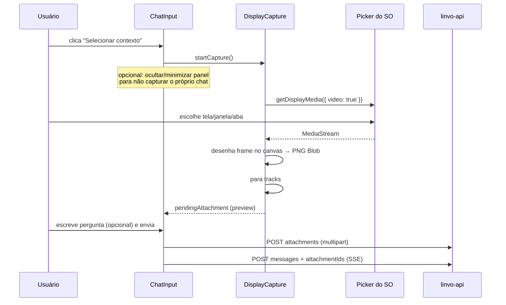

# Spec — Select View Context (Frontend / Desktop)

**Feature:** selecionar janela/aba/tela e anexar print como contexto visual no chat  
**Repos:** `apps/desktop` (Tauri + React)  
**Contrato:** `@linvo/shared` + API descrita em [select-view-context-backend.md](./select-view-context-backend.md)  
**Status:** proposta

---

## 1. Objetivo

No chat do painel, o usuário clica em um controle (ícone de seleção de contexto), o SO abre o picker de captura, ele escolhe **tela / janela de app / aba** (quando o OS oferecer), o app gera um **screenshot**, mostra preview no composer e envia junto com a mensagem para o assistente.

MVP = **print**. Texto estruturado da UI (OCR / Accessibility / DOM) fica fora.

---

## 2. Fora de escopo (frontend MVP)

- Picker customizado com overlay hover em janelas (Win32 HWND).
- Extração de texto da janela selecionada.
- Extensão de browser para ler DOM.
- Gravação de vídeo neste fluxo (já existe em procedure recorder).
- Ativar o `Paperclip` genérico de arquivos (pode reutilizar preview depois).
- Mudanças nativas Rust além do necessário (MVP usa `getDisplayMedia` no WebView).

---

## 3. Contexto atual (baseline)

| Peça | Estado hoje |
|------|-------------|
| `ChatInput` | texto + Tools + model picker; `Paperclip` disabled “Em breve” |
| `ChatToolsMenu` | só `web_search` / `search_knowledge` |
| `sendMessage` / `streamChatResponse` | só `content: string` |
| Captura de tela | já usada em `use-procedure-recorder` via `getDisplayMedia` |
| Clipboard texto | tool `read_clipboard` no chat |

A feature reaproveita o caminho de display media, mas captura **1 frame**, não `MediaRecorder`.

---

## 4. UX

### 4.1 Entrada

No composer (`ChatInput`), ao lado de Tools:

- Novo botão **“Selecionar contexto”** (ícone sugerido: `Scan` / `SquareDashedMousePointer` / `Crosshair` do lucide).
- Tooltip: `Selecionar janela ou tela`.
- Não confundir com o `ArrowUp` de enviar.
- Alternativa aceitável: item dentro do menu Tools — preferência é botão dedicado (ação de captura ≠ force tool).

### 4.2 Fluxo feliz



### 4.3 Preview no composer

Acima do textarea (mesmo padrão visual do chip de `forceTool`):

- Thumbnail (~48–64px), nome curto (`Janela capturada` / filename).
- Botão `X` para remover.
- Estados: `capturing` | `ready` | `uploading` | `error`.

### 4.4 Estados vazios / erro

| Situação | UI |
|----------|-----|
| Usuário cancela o picker | silencioso; sem erro |
| Permissão negada / API indisponível | toast/texto inline: `Não foi possível capturar a tela` |
| Captura OK, upload falha | manter preview + mensagem de erro; permitir retry no send |
| Modelo sem vision (erro API) | erro de chat existente + copy clara |
| Já existe 1 anexo no MVP | novo clique substitui o anterior (com confirmação leve ou replace direto) |

### 4.5 Comportamento da janela do Linvo

Para não capturar o próprio painel por acidente:

1. Antes do picker: `panel` pode `minimize` / `hide` temporariamente **ou** o usuário escolhe outra janela no picker.
2. MVP recomendado: **não esconder automaticamente** (mais previsível); documentar no tooltip que o usuário deve escolher a janela alvo.
3. Fase 1.1: opção “ocultar Linvo durante captura”.

Always-on-top da floating bar: não deve bloquear o picker do SO.

---

## 5. Captura técnica

### 5.1 Módulo novo

Criar algo como:

- `apps/desktop/src/lib/context-capture/display-snapshot.ts`
- `apps/desktop/src/hooks/use-display-snapshot.ts`

API sugerida:

```ts
type DisplaySnapshot = {
  blob: Blob;          // image/png
  mimeType: "image/png";
  filename: string;    // context-YYYYMMDD-HHMMSS.png
  width: number;
  height: number;
  sourceLabel?: string; // se o browser expor track label
};

async function captureDisplaySnapshot(): Promise<DisplaySnapshot>;
```

Passos:

1. `navigator.mediaDevices.getDisplayMedia({ video: true, audio: false })`.
2. Criar `<video>` muted, `srcObject = stream`, aguardar `loadedmetadata` + `play()`.
3. Opcional: esperar 1–2 frames (`requestAnimationFrame` ×2) para evitar frame preto.
4. `canvas.width/height = video.videoWidth/Height`; `drawImage`.
5. `canvas.toBlob('image/png')`.
6. `stream.getTracks().forEach(t => t.stop())` sempre (incluindo cancel/erro).

Reusar o mesmo estilo testável do procedure recorder (`startDisplayMedia` injetável).

### 5.2 Limites no cliente

| Limite | Valor |
|--------|-------|
| Anexos no composer | 1 (MVP) |
| MIME gerado | `image/png` |
| Downscale local se maior lado > 2048px | sim (canvas) |
| Tamanho alvo | preferencialmente < 5 MiB (qualidade PNG; se estourar, reencode JPEG q~0.85) |

### 5.3 Permissões Tauri / WebView2

- `getDisplayMedia` já funciona no fluxo de procedure — validar no mesmo ambiente.
- Não deve precisar de comando Rust novo no MVP.
- Se em algum build o picker falhar: documentar fallback “colocar print na área de transferência” (fase 2).

---

## 6. Integração com chat

### 6.1 Estado do composer

Estender `ChatInput` / hook de envio:

```ts
type PendingContextAttachment = {
  localId: string;
  file: File; // ou Blob + filename
  previewUrl: string; // URL.createObjectURL
  width: number;
  height: number;
  status: "ready" | "uploading" | "error";
  serverAttachmentId?: string;
  errorMessage?: string;
};
```

- Revogar `previewUrl` no unmount / remove (`URL.revokeObjectURL`).
- `canSend`: texto **ou** anexo ready (alinhar com schema backend).

### 6.2 `use-chat` / `chat-api`

1. Antes do stream (ou no início do send):
   - se houver pending sem `serverAttachmentId` → `uploadChatAttachment(conversationId, file)`.
2. `streamChatResponse` passa a aceitar `attachmentIds?: string[]`.
3. Mensagem otimista do user mostra thumbnail local.
4. No `onUserMessage`, substituir por mensagem da API (com `attachments`).

Novos helpers:

- `apps/desktop/src/lib/chat/chat-attachments-api.ts`
  - `uploadChatAttachment(conversationId, file, { source: "display_capture" })`
  - (opcional) `fetchChatAttachmentBlob(...)` para histórico

### 6.3 Render da mensagem

Em `chat-message.tsx` (bolha do user):

- Se `message.attachments?.length`, renderizar imagem(ns) acima/abaixo do texto.
- Lazy load via `attachment.url` ou GET autenticado.
- Clique abre preview maior (dialog simples) — nice-to-have MVP.

Tipos locais (`lib/chat/types.ts` / `map-message.ts`) devem mapear `attachments` do schema shared.

### 6.4 Cache local

`chat-local-store` / persistência Tauri: gravar metadados do attachment; **não** obrigar a persistir o binário local no MVP (reload pode buscar da API).

---

## 7. Shared / contratos consumidos

O desktop **não inventa** o shape: consome de `@linvo/shared` após a spec de backend:

- `messageAttachmentSchema`
- `sendMessageInputSchema` com `attachmentIds`
- `chatAttachmentUploadResponseSchema`

Até a API estar pronta, o front pode:

1. Implementar captura + preview **sem send** (feature flag), ou
2. Feature flag `VITE_CONTEXT_CAPTURE=1` liberando o botão só com API compatível.

---

## 8. Arquivos impactados (estimativa)

| Área | Arquivos |
|------|----------|
| UI input | `components/chat/chat-input.tsx`, novo `chat-context-capture-button.tsx`, preview chip |
| Mensagem | `components/chat/chat-message.tsx`, testes |
| Hook chat | `hooks/use-chat.ts` |
| API | `lib/chat/chat-api.ts`, `lib/chat/chat-attachments-api.ts` |
| Capture | `lib/context-capture/display-snapshot.ts`, `hooks/use-display-snapshot.ts` |
| Shared | `packages/shared/src/chat.ts` (+ tests) — coordenado com backend |
| Map/types | `lib/chat/map-message.ts`, `lib/chat/types.ts` |

---

## 9. Acessibilidade e usabilidade

- Botão com `aria-label` e `title` claros.
- Preview removível por teclado.
- Durante `capturing`, desabilitar botão e indicar loading.
- Não roubar foco do textarea após captura bem-sucedida (foco volta ao input).
- Respeitar `disabled` / `isResponding` (igual Tools).

---

## 10. Critérios de aceite (frontend)

- [ ] Botão “Selecionar contexto” visível e habilitado quando o chat aceita input.
- [ ] Clique abre o picker nativo (`getDisplayMedia`).
- [ ] Cancelar o picker não quebra o composer.
- [ ] Após seleção, aparece preview com opção de remover.
- [ ] Send com texto + print sobe attachment e inclui `attachmentIds` no POST.
- [ ] Send só com print (sem texto) é permitido quando a API já aceitar.
- [ ] Bolha do usuário exibe a imagem após envio.
- [ ] Tracks da MediaStream são sempre paradas (sem LED/captura presa).
- [ ] Imagens muito grandes são downscaladas no cliente antes do upload.
- [ ] Testes unitários do snapshot (stream fake + canvas mock) e do composer (preview/remove/send).
- [ ] Regressão: send só texto e Tools (`forceTool`) continuam iguais.

---

## 11. Test plan (desktop)

1. Abrir chat → botão visível.
2. Capturar janela do Notepad/Browser → preview OK.
3. Remover preview → send só texto OK.
4. Capturar + pergunta → upload + stream OK (com API).
5. Cancelar picker → estado idle.
6. Negar permissão (se simulável) → erro amigável.
7. Durante `isResponding`, botão disabled.
8. Trocar de conversa com preview pendente → limpar pending (evitar anexo na conversa errada).
9. Vitest: `display-snapshot` com `startDisplayMedia` mockado.
10. Vitest: `ChatInput` mostra/remove chip de contexto.

---

## 12. Fases

| Fase | Entrega |
|------|---------|
| **MVP** | Botão + `getDisplayMedia` + frame PNG + preview + upload/send (API pronta) + render na bolha |
| **1.1** | Ocultar panel durante captura; dialog de preview ampliado; JPEG fallback automático |
| **2** | Colar print do clipboard (`Ctrl+V` imagem) no mesmo pending attachment |
| **3** | OCR local opcional / seleção de região (crop) sobre o print |

---

## 13. Riscos

| Risco | Mitigação |
|-------|-----------|
| WebView2 não listar abas do Chrome como o Chrome | Aceitar “janela do browser” inteira no MVP |
| Frame preto no primeiro draw | Esperar metadata + 1–2 rAF |
| Upload grande / lento | Downscale local + 1 anexo + status uploading |
| API atrasada | Feature flag / preview-only |
| Capturar o próprio Linvo | Tooltip + fase 1.1 hide panel |

---

## 14. Open questions

1. O botão fica no composer do panel apenas, ou também no quick menu flutuante?
2. Feature flag por env ou rollout sempre on após API?
3. Precisamos de crop (seleção de região) já no MVP? (recomendação: **não**)
4. Ao regenerar resposta, o front precisa reenviar attachments ou a API reutiliza os da user message? (spec backend recomenda reutilizar no server)
